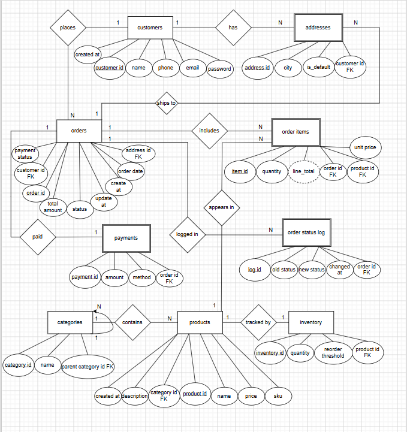

# 🛒 E-Commerce Order Management System - Database Design


> A fully normalized (3NF) relational database for E-Commerce Order Management System built with Microsoft SQL Server and T-SQL.

---

## 📋 Table of Contents

- [Technologies Used](#-technologies-used)
- [Project Information](#-project-information)
- [Team Members](#-team-members)
- [Database Schema](#-database-schema)
- [Key Technical Features](#-key-technical-features)
- [ER Diagram](#-er-diagram)
- [Deliverables Progress](#-deliverables-progress)
- [How to Deploy](#-how-to-deploy)
- [Related Projects](#-related-projects)
- [Next Phase](#-next-phase)

---

## 🛠️ Technologies Used

| Category | Technology |
|----------|------------|
| **Database** | Microsoft SQL Server 2022 |
| **Query Language** | T-SQL (Transact-SQL) |
| **Management Tool** | SQL Server Management Studio (SSMS) |
| **Diagramming** | draw.io / dbdiagram.io |
| **Version Control** | Git & GitHub |

---

## 📊 Project Information

| Field | Detail |
|-------|--------|
| **Course** | Database Systems (CC230L) |
| **Instructor** | Sir Shahzaib Mushtaq Shah |
| **Submission Date** | June 10, 2026 |

---

## 👥 Team Members

| Name | Student ID |
|------|------------|
| Muhammad Anas Tahir | F2024266985 |
| Muhammad Talha Bhatti | F2024266503 |
| Zohaib Ahmad | F2024266251 |
| Maniha Ashraf | F20242661269 |

---

## 📖 Project Overview

This relational database design simulates the complete lifecycle of online retail transactions — from customer registration and product browsing through order placement, payment, and inventory updates — using **Microsoft SQL Server** and **T-SQL**.

### Key Capabilities

- ✅ Customer and address management
- ✅ Product catalog with hierarchical categories (self-referencing FK)
- ✅ Inventory tracking with reorder threshold alerts
- ✅ Order processing with computed totals
- ✅ Payment recording and status tracking
- ✅ Automated triggers for inventory decrement and audit logging
- ✅ Analytical reporting queries (RFM, segmentation, turnover)

---

## 🗄️ Database Schema (9 Tables - 3NF)

| # | Table | Description | Columns |
|---|-------|-------------|---------|
| 1 | customers | Customer information | 6 |
| 2 | addresses | Shipping/billing addresses | 7 |
| 3 | categories | Product hierarchy (self-referencing) | 3 |
| 4 | products | Product catalog | 7 |
| 5 | inventory | Stock tracking | 5 |
| 6 | orders | Order header | 9 |
| 7 | order_items | Line items with computed column | 6 |
| 8 | payments | Transaction records | 6 |
| 9 | order_status_log | Audit trail | 5 |

### Entity Types

| Type | Entities |
|------|----------|
| **Strong Entities** | customers, categories, products, inventory, orders |
| **Weak Entities** | addresses, order_items, payments, order_status_log |
| **Self-Referencing** | categories (parent_category_id) |

---

## ⚙️ Key Technical Features

| Feature | Description |
|---------|-------------|
| **Normalization** | 3NF (1NF, 2NF, 3NF compliant) |
| **Triggers** | Inventory decrement + Order status audit + Single default address |
| **Computed Column** | `line_total AS (quantity * unit_price) PERSISTED` |
| **Self-Referencing** | `categories.parent_category_id` for hierarchy |
| **Indexes** | 15+ performance indexes |
| **Stored Procedures** | Monthly revenue, top products, low stock alerts |
| **Analytical Queries** | 10 BI queries (RFM analysis, customer segmentation, turnover) |

---

## 🖼️ ER Diagram



*Figure 1: Entity Relationship Diagram showing 9 tables, relationships, and cardinalities*

📄 [View Complete ER Documentation](docs/ERD_Final.md)

---

## 📋 Deliverables Progress

| # | Deliverable | Status | Date |
|---|-------------|--------|------|
| 1 | Project Proposal Document | ✅ Complete | May 24, 2026 |
| 2 | ER Diagram (draw.io) | ✅ Complete | June 10, 2026 |
| 3 | 3NF Normalization Documentation | ✅ Complete | May 25, 2026 |
| 4 | Complete SQL Schema | ✅ Complete | June 10, 2026 |
| 5 | Triggers Implementation | ✅ Complete | June 10, 2026 |
| 6 | Stored Procedures | ✅ Complete | June 10, 2026 |
| 7 | Sample Data (50+ rows per table) | ✅ Complete | June 10, 2026 |
| 8 | Analytical Queries | ✅ Complete | June 10, 2026 |
| 9 | SSMS Execution Screenshots | 🔜 Tomorrow | June 11, 2026 |
| 10 | Final Report | 🔜 Tomorrow | June 11, 2026 |

**Progress: 8/10 Deliverables Complete (80%)**


---

## 🚀 How to Deploy

### Prerequisites
- Microsoft SQL Server 2019/2022
- SQL Server Management Studio (SSMS)

### Deployment Steps

```sql
-- Step 1: Open SQL Server Management Studio
-- Step 2: Connect to your SQL Server instance
-- Step 3: Execute the complete script
-- File location: sql/E-Commerce Project.sql

-- The script includes:
-- ✅ CREATE DATABASE
-- ✅ 9 tables with constraints
-- ✅ Foreign keys and indexes
-- ✅ 3 triggers
-- ✅ 3 stored procedures
-- ✅ 10 analytical queries
-- ✅ Sample data (50+ rows)